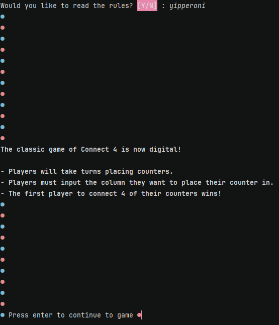

# Results of Testing

The test results show the actual outcome of the testing, following the [Test Plan](test-plan.md)

---

## Getting the players names

When a player inputs their name, it should not be blank and must fulfill the maximum character limit

### Test Data To Use

Start the game and input various names and non-names to test all possible types of input from the user (Short name, too-long name,blank space)

### Test Result

When the name is too long, the user is told their name is too long and is asked again. Names within the character limit are accepted. Non names are accepted and do not break the code.

---

## Yes/No response

A player is asked whether they would like to read the rules and is required to input a variation of yes or no

### Test Data To Use

Input blank spaces, non yes/no answers, and different variations of yes/no (yep, Y, yipperoni)

### Test Result

All inputs beginning with y or n in any case is accepted and continues normally, anything else and the user is asked again until they input correctly.

---

## Press enter to continue

The user should be asked for confirmation before continuing to the game by pressing enter

### Test Data To Use

Pressing enter, inputting letters, numbers, symbols, and extra spaces

### Test Result

Only blank spaces are accepted and allows user to continue to game.
---

## Ask user where they would like to place their counter

The user is prompted to input the numbered column they would like to place their counter in and their counter is placed.
The user should be told if the column they select is full, and should be booted if they continue to attempt to place counters in rows that are full

### Test Data To Use

Valid column numbers, invalid column numbers, non-numbers, blank spaces

### Test Result

The user is asked again when they provide an invalid input. Counters are placed correctly when a valid input is given.
---

## Game win

If there are four counters in a row, a winner should be announced

### Test Data To Use

Lining up counters in all directions with both players.

### Test Result

Comment on test result.

---

## Example Test Name

Example test description.

### Test Data Used

Details of test data.

### Test Result

Comment on test result.

---

